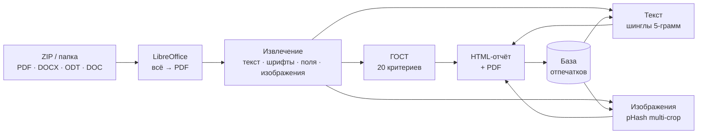
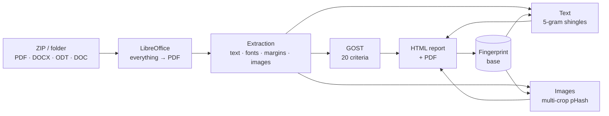

<div align="center">


# АЛЁНА

**А**втоматический **Л**овец **Ё**рничества, **Н**ебрежности и **А**утентичности

*Проверка студенческих отчётов: заимствования, дубли изображений и ГОСТ 7.32-2017 – за один проход*

[](https://www.python.org/)
[](https://flask.palletsprojects.com/)
[](https://www.postgresql.org/)
[](https://docs.docker.com/compose/)
[](LICENSE)

**Русский** · [English](#english)

</div>

---

## Что это

Преподаватель загружает папку или ZIP с работами группы – АЛЁНА возвращает один
самодостаточный HTML-отчёт, в котором по каждому студенту видно: что списано,
какие картинки повторяются, какие пункты ГОСТ нарушены и какая оценка за
оформление получается.

Принимаются **PDF, DOCX, ODT и DOC**. Постоянная база отпечатков позволяет
сравнивать новую партию не только между собой, но и со всеми прошлыми сессиями –
работа, сданная в сентябре, будет узнана в декабре.

> Три проверки идут за один проход по одному и тому же документу: файл читается
> один раз, а не трижды разными инструментами.

---

## Возможности

| | Проверка | Как устроено |
|---|---|---|
| 📝 | **Заимствование текста** | Шинглы из 5-грамм слов, мера Жаккара, настраиваемый порог. В отчёте – матрица совпадений и дословные общие фрагменты |
| 🖼 | **Дублирование изображений** | Перцептуальный хеш pHash 12×12 (144 бита) в трёх масштабах кадрирования – обрезанный по краям скриншот всё равно опознаётся |
| 📐 | **ГОСТ 7.32-2017** | 20 критериев: 9 структурных и 11 по оформлению – от полей страницы до подписей рисунков |
| 🎓 | **Рекомендуемая оценка** | Веса критериев нормируются к 100; готовый отзыв студенту формулируется словами замечания, а не пунктами стандарта |
| 🗂 | **База отпечатков** | Отпечатки живут между проверками и изолированы по преподавателям |
| 👥 | **Учётные записи** | Роли, гранулярные права, журнал действий, политика паролей |
| 🔌 | **REST API** | `/api/v1` с доступом по ключу – для встраивания в LMS и свои сервисы |
| 📄 | **Экспорт** | Автономный HTML (открывается без сети) и PDF через WeasyPrint |

### Что именно ловит детектор изображений

Скриншоты интерфейсов (Zabbix, терминал, IDE) у разных студентов похожи
**по устройству**, а не потому, что их списали. Для таких изображений порог
строже, и пограничные пары помечаются как «похожий интерфейс, проверьте
вручную», а не как копия.

Работы, из которых извлеклось меньше 30 слов (скан, PDF со сломанной кодировкой
шрифта), выводятся из текстового сравнения и помечаются отдельно – иначе целая
пачка сканов обвинялась бы в списывании друг у друга.

---

## Как это работает



**Почему всё приводится к PDF.** Половина критериев ГОСТ измеряется на
свёрстанной странице: поля – по краям чернил букв, номер страницы – как
отдельная строка в поле, титульный лист опознаётся постранично. У DOCX страниц
нет, пока его не сверстают, поэтому разбор XML отвечал бы на другие вопросы и
давал бы другой вердикт для той же работы. Приведение к PDF – единственный
способ сдержать обещание «все форматы судятся одинаково».

**Своё не считается списанным.** Студенты из текущей партии исключаются из
исторического списка перед сравнением – иначе работа совпала бы со своим же
отпечатком с прошлой сессии.

---

## Быстрый старт

### Docker (рекомендуется)

```bash
cp .env.example .env
# отредактируйте .env: POSTGRES_PASSWORD и SECRET_KEY обязательны
docker compose up --build
```

Откройте <http://localhost:5000> и войдите под учётной записью из `AU_USERNAME`
и `AU_PASSWORD`. При пароле, похожем на стандартный, система попросит сменить
его при первом входе.

Образ уже содержит LibreOffice, шрифты Microsoft и библиотеки WeasyPrint –
ничего доустанавливать не нужно.

### Локально

```bash
pip install -r requirements.txt
python app.py            # http://localhost:5000
python app.py 8080       # другой порт
```

Без `DATABASE_URL` приложение работает на JSON-хранилище в `memory/` –
PostgreSQL для запуска не обязателен.

### На сервере

```bash
gunicorn --workers=1 --threads=8 --timeout=300 -b 0.0.0.0:5000 app:app
```

> ⚠️ **`--workers=1` – требование, а не настройка производительности.**
> Частичные загрузки и состояние идущих проверок лежат в памяти процесса.
> Со вторым воркером куски одной партии попадают в разные процессы и загрузка
> обрывается сообщением «Загрузка не найдена». Параллелизм даёт `--threads`.
> Пример конфигурации nginx – в [`nginx.conf.txt`](nginx.conf.txt).

### Командная строка, без сервера и учётных записей

```bash
python check_reports.py ./папка_с_отчётами -o отчёт.html --threshold 0.5
python check_reports.py ./архив.zip
```

---

## Настройка

Все параметры – переменные окружения; полный список с пояснениями лежит в
[`.env.example`](.env.example).

| Переменная | Назначение |
|---|---|
| `AU_USERNAME` · `AU_PASSWORD` · `AU_FIO` | Первый администратор. Используются только при пустом списке учётных записей |
| `SECRET_KEY` | Секрет сессий. **Обязателен в продакшене** – без него ключ генерируется при старте и каждый перезапуск разлогинивает всех |
| `AU_API_KEY` | Ключ для `/api/v1`, выдаётся первому администратору при развёртывании |
| `AU_HTTPS` | `1` за HTTPS: cookie сессии помечается `Secure` |
| `DATABASE_URL` | PostgreSQL. Пусто → JSON-хранилище в `memory/` |
| `AU_MAX_UPLOAD_MB` | Предел одной партии, МБ (по умолчанию 5120) |
| `AU_TMP_DIR` | Где разворачиваются загрузки. Проверьте, что это диск, а не tmpfs – иначе многогигабайтная партия пишется в RAM |
| `AU_SOFFICE` | Путь к LibreOffice, если он вне `PATH` |
| `PORT` | Порт веб-интерфейса (по умолчанию 5000) |

Настройки уровня приложения – порог сходства по умолчанию, набор критериев,
веса для оценки, шкала, срок хранения проверок, политика паролей и блокировки –
задаются в интерфейсе: **Администрирование → Настройки**.

---

## Интерфейс

| Раздел | Что там |
|---|---|
| **Проверки** | Загруженные партии, прогресс, отчёты, остановка идущей проверки |
| **Новая проверка** | Загрузка папки или ZIP, выбор критериев, порог, веса |
| **Обзор** | Сводка: успеваемость, частые нарушения, динамика |
| **База отпечатков** | Что хранится, выгрузка таблицей или JSON-дампом, удаление записей |
| **Пользователи** | Учётные записи, права, выдача ключей API |
| **Журнал** | Кто что делал и когда |
| **Настройки** | Значения по умолчанию, пароли, состояние системы |
| **Миграция базы** | Перенос данных между JSON и PostgreSQL в обе стороны |

### Роли и права

По умолчанию преподаватель изолирован: свои проверки, своя база отпечатков,
заимствования ищутся только внутри неё. Ключи отпечатков включают владельца,
поэтому два преподавателя с однофамильцами-студентами не пересекаются.

Права выдаются **по учётной записи**, а не по роли:

| Право | Что разрешает |
|---|---|
| `run_checks` | Запускать новые проверки |
| `delete_own` | Удалять свои проверки |
| `delete_all` | Удалять данные всех преподавателей; действует только вместе с ролью `admin` |
| `manage_base` | Удалять записи из базы отпечатков |
| `see_all` | Видеть проверки других преподавателей |
| `use_api` | Пользоваться API по ключу |

Снятие `run_checks` останавливает новые проверки, но не прячет собственную
историю учётной записи. `see_all` даёт только чтение и никогда не расширяет
область удаления. Глобальная очистка вынесена в отдельное действие, требует
`delete_all` и подтверждения логином текущего администратора.
У учётных записей, созданных до появления `delete_all`, это право выключено:
администратор включает его явно в разделе **Пользователи**.

### Группы преподавателей

Кафедра ведёт один курс вдвоём, и работа, сданная одному преподавателю, для
второго невидима. Раздел **Группы преподавателей** (только у администратора,
`/admin/teams`) объединяет базы отпечатков нескольких учётных записей:
участники ищут заимствования по работам друг друга.

Объединяется **только база**. Проверки, отчёты и история остаются личными –
группа их не открывает. Чужой отпечаток участник видит в разделе «База», но
удалить не может: он нужен коллеге для его собственных проверок.

Преподаватель может состоять в нескольких группах – тогда его база это
объединение всех. Роспуск группы ничего не удаляет: отпечатки принадлежат
своим владельцам, и база просто снова становится личной.

Тот же студент, сдавший работу другому преподавателю группы, за плагиат не
считается: в истории он отсеивается по ФИО и группе, а не по владельцу
записи, – иначе пересдача выглядела бы как стопроцентное списывание у себя.
Если имя не распознано (даже когда известна только группа), из сравнения
исключается лишь точное совпадение с прошлой версией по имени файла и SHA-256
нормализованного текста; для скана без текста используются точные pHash его
изображений. Остальные обезличенные работы продолжают сравниваться между собой.

---

## Критерии ГОСТ 7.32-2017

<details>
<summary><b>Структурные элементы (S1–S9)</b></summary>

| Код | Критерий |
|---|---|
| `S1` | Титульный лист |
| `S2` | Задание на практику или курсовую |
| `S3` | Реферат |
| `S4` | Содержание |
| `S5` | Введение: актуальность, цель, задачи |
| `S6` | Главы (нумерованные разделы) |
| `S7` | Подглавы (подразделы) |
| `S8` | Заключение |
| `S9` | Список использованных источников |

`S3` обязателен для отчёта о НИР и ВКР; для отчёта по практике и курсовой обычно
не требуется – снимите критерий, если он не нужен.

</details>

<details>
<summary><b>Оформление (F1–F11)</b></summary>

| Код | Критерий |
|---|---|
| `F1` | Нумерация страниц |
| `F2` | Шрифт Times New Roman |
| `F3` | Основной текст 14 пт |
| `F4` | Текст рисунков и таблиц не больше 14 пт |
| `F5` | Шрифт номеров страниц |
| `F6` | Подписи рисунков: «Рисунок 1 – Название» |
| `F7` | Ссылки на рисунки в тексте |
| `F8` | Подписи таблиц: «Таблица 1 – Название» |
| `F9` | Точки в конце заголовков |
| `F10` | Ссылки на источники `[N]` |
| `F11` | Поля страницы: 30 / 15 / 20 / 20 мм |

Титульный лист и лист задания освобождены от правил размера и полей, но не от
правила гарнитуры: на них текст обычно выровнен по центру, а вот шрифт должен
быть тем же.

</details>

Любой критерий можно отключить для конкретной проверки. Критерий с весом `0`
по-прежнему проверяется и попадает в отзыв – он просто не двигает оценку.

---

## API

REST-слой `/api/v1` возвращает JSON, включая ошибки. Полная спецификация –
[`API_REFERENCE.md`](API_REFERENCE.md).

```bash
# запустить проверку
curl -X POST http://localhost:5000/api/v1/jobs \
     -H "X-API-Key: $AU_API_KEY" \
     -F "files=@Иванов.pdf" -F "files=@Петров.docx" \
     -F "threshold=0.6" -F "gost=S1,S4,F2,F3,F11"

# следить за прогрессом
curl -H "X-API-Key: $AU_API_KEY" http://localhost:5000/api/v1/jobs/<job_id>

# забрать отчёт
curl -H "X-API-Key: $AU_API_KEY" http://localhost:5000/api/v1/jobs/<job_id>/export -o отчёт.pdf
```

| Метод | Путь | Действие |
|---|---|---|
| `GET` | `/health` | Проверка живости, без авторизации |
| `POST` | `/jobs` | Запустить проверку |
| `GET` | `/jobs` · `/jobs/<id>` | Список проверок · состояние одной |
| `POST` | `/jobs/<id>/cancel` | Остановить идущую проверку |
| `GET` | `/jobs/<id>/report` · `/export` | HTML-отчёт · PDF |
| `DELETE` | `/jobs/<id>` · `/jobs?scope=own\|all` | Удалить проверку · очистить свои или все данные |
| `GET` | `/memory` | Содержимое базы отпечатков |
| `DELETE` | `/memory/<key>` | Удалить запись из базы |

Для `DELETE /jobs` параметр `scope` обязателен. `scope=all` доступен только
администратору с `delete_all` и требует `confirm_login=<логин администратора>`.

Авторизация – заголовок `X-API-Key` либо сессия браузера (тогда изменяющие
вызовы дополнительно требуют `X-CSRF-Token`). Каждый вызов действует **от имени
учётной записи** и видит только её данные.

---

## Хранилище

Каждый модуль работает одинаково: **PostgreSQL**, если задан `DATABASE_URL`,
иначе **JSON-файлы** в `memory/`. Переключение – вопрос одной переменной, а
перенос данных в обе стороны делается через **Администрирование → Миграция
базы**.

Импортёр разбирает дамп собственным парсером и **никогда его не исполняет** –
«восстановить базу» не означает «выполнить произвольный SQL».
Режим **Полная замена** удаляет текущие данные, поэтому требует `delete_all`,
ввода логина администратора и отсутствия выполняющихся проверок.

Каталоги `memory/`, `reports/` и файл `.env` – это состояние времени
выполнения, а не код; они исключены из репозитория.

---

## Требования

| | |
|---|---|
| **Python** | 3.11+ |
| **LibreOffice** | Для DOCX / ODT / DOC. Без него эти форматы отклоняются по файлу, PDF в той же партии проверяются как обычно |
| **Шрифты Microsoft** | **Обязательны рядом с LibreOffice.** Без них подставляется метрически совместимый Liberation Serif: вёрстка не съезжает, но в готовом PDF гарнитура называется уже им – и критерии `F2`/`F5` проваливала бы каждая работа в DOCX |
| **Pango / Cairo** | Для WeasyPrint. Без них приложение работает, а экспорт в PDF возвращает `501` |
| **PostgreSQL** | Опционально |

Всё перечисленное уже собрано в [`Dockerfile`](Dockerfile).

---

## Разработка

Регрессионные тесты запускаются без дополнительных зависимостей:
`python -m unittest discover -s tests -v`. Для сквозной проверки реальных PDF
используется `check_reports.py`; синтаксис отдельно ловит `python -m py_compile`.
Конфигурации линтера и отдельного шага сборки в проекте нет.

Комментарии в коде объясняют **почему**, а не что делает строка, и часто
называют ошибку, ради которой код написан. Новый критерий ГОСТ – это строка в
таблице `GOST_CHECKS`, функция `_check_*` в `check_gost()` и запись в
`FLAW_TEXT`; всё остальное выводится из таблицы. При добавлении сохраняемого
поля его нужно провести по обоим хранилищам – по колонкам PostgreSQL и по
словарю JSON, – и по кортежам в `checker/sqlmigrate.py`.

---

## Лицензия

[GNU AGPL-3.0](LICENSE) · `#au_team`

---
---

<div align="center">


# <a name="english"></a>АЛЁНА / ALYONA

**А**втоматический **Л**овец **Ё**рничества, **Н**ебрежности и **А**утентичности
*– "Automatic Catcher of Mockery, Sloppiness and Authenticity", an acronym
spelling out the Russian given name Alyona*

*Student report checking: borrowing, duplicated images and GOST 7.32-2017 – in a single pass*

[Русский](#алёна) · **English**

</div>

> The interface, comments and all user-facing strings are in Russian – the tool
> is built for Russian-language academic reports and the GOST standard they are
> graded against. This section documents it for readers who do not read Russian.

---

## What it is

A teacher uploads a folder or ZIP of a group's work – ALYONA returns one
self-contained HTML report showing, per student: what was copied, which images
repeat, which GOST clauses are violated, and what formatting grade follows.

**PDF, DOCX, ODT and DOC** are accepted. A persistent fingerprint base compares
each new batch not only against itself but against every earlier session – work
submitted in September is recognised in December.

> All three checks run in a single pass over the same document: the file is read
> once, not three times by three different tools.

---

## Features

| | Check | How it works |
|---|---|---|
| 📝 | **Text borrowing** | 5-gram word shingles, Jaccard similarity, configurable threshold. The report shows a match matrix and the verbatim shared passages |
| 🖼 | **Duplicated images** | 12×12 perceptual hash (144-bit) at three crop scales – a screenshot trimmed at the edges is still recognised |
| 📐 | **GOST 7.32-2017** | 20 criteria: 9 structural and 11 formatting – from page margins to figure captions |
| 🎓 | **Recommended grade** | Per-criterion weights normalised to 100; the student-facing feedback is phrased as a remark, not as a clause number |
| 🗂 | **Fingerprint base** | Fingerprints persist between checks and are isolated per teacher |
| 👥 | **Accounts** | Roles, granular permissions, audit log, password policy |
| 🔌 | **REST API** | `/api/v1` with key access – for embedding into an LMS or your own services |
| 📄 | **Export** | Standalone HTML (opens offline) and PDF via WeasyPrint |

### What the image detector actually catches

Interface screenshots (Zabbix, a terminal, an IDE) from different students look
alike **by design**, not because they were copied. Those get a stricter bar, and
borderline pairs are flagged as "similar interface, check manually" rather than
as a copy.

Reports yielding fewer than 30 extracted words (a scan, a PDF with a broken font
encoding) are excluded from text comparison and flagged separately – otherwise a
batch of scans would accuse itself of wholesale plagiarism.

---

## How it works



**Why everything becomes a PDF.** Half the GOST criteria are measured on a
laid-out page: margins from the ink extents of glyphs, the page number as its own
line in the margin band, title sheets recognised page by page. A DOCX has no
pages at all until it is laid out, so parsing its XML would answer different
questions and return a different verdict on the same work. Converting to PDF is
the only way the promise "every format is judged the same" can hold.

**Your own work is not plagiarism.** Students present in the current batch are
excluded from the historical list before comparison – otherwise a student would
match their own stored fingerprint from last session.

---

## Quick start

### Docker (recommended)

```bash
cp .env.example .env
# edit .env: POSTGRES_PASSWORD and SECRET_KEY are required
docker compose up --build
```

Open <http://localhost:5000> and sign in with `AU_USERNAME` / `AU_PASSWORD`. If
the password looks like a default, the account is asked to change it at first
login.

The image already contains LibreOffice, the Microsoft fonts and the WeasyPrint
libraries – nothing else to install.

### Local

```bash
pip install -r requirements.txt
python app.py            # http://localhost:5000
python app.py 8080       # another port
```

Without `DATABASE_URL` the app runs on the JSON store in `memory/` – PostgreSQL
is not required to start.

### On a server

```bash
gunicorn --workers=1 --threads=8 --timeout=300 -b 0.0.0.0:5000 app:app
```

> ⚠️ **`--workers=1` is a requirement, not a performance setting.**
> In-flight chunked uploads and live job state live in process memory. With a
> second worker, chunks of one batch reach different processes and the upload
> fails with «Загрузка не найдена». Concurrency comes from `--threads`.
> A sample nginx config is in [`nginx.conf.txt`](nginx.conf.txt).

### Command line – no server, no accounts

```bash
python check_reports.py ./reports_folder -o report.html --threshold 0.5
python check_reports.py ./archive.zip
```

---

## Configuration

Everything is an environment variable; the full annotated list is in
[`.env.example`](.env.example).

| Variable | Purpose |
|---|---|
| `AU_USERNAME` · `AU_PASSWORD` · `AU_FIO` | First administrator. Used only while the account list is empty |
| `SECRET_KEY` | Session secret. **Required in production** – without it a key is generated at startup and every restart logs everyone out |
| `AU_API_KEY` | Key for `/api/v1`, assigned to the first administrator at bootstrap |
| `AU_HTTPS` | `1` behind HTTPS: the session cookie is marked `Secure` |
| `DATABASE_URL` | PostgreSQL. Empty → JSON store in `memory/` |
| `AU_MAX_UPLOAD_MB` | Largest single batch, MB (default 5120) |
| `AU_TMP_DIR` | Where uploads are staged. Check it is on disk, not tmpfs – otherwise a multi-gigabyte batch is written straight into RAM |
| `AU_SOFFICE` | Path to LibreOffice if it is outside `PATH` |
| `PORT` | Web UI port (default 5000) |

Application-level settings – the default similarity threshold, the criteria set,
grade weights and scale, retention period, password and lockout policy – are set
in the UI under **Администрирование → Настройки** (Administration → Settings).

---

## The interface

| Section | Contents |
|---|---|
| **Проверки** (Checks) | Uploaded batches, progress, reports, stopping a running check |
| **Новая проверка** (New check) | Upload a folder or ZIP, pick criteria, threshold, weights |
| **Обзор** (Overview) | Digest: performance, frequent violations, trends |
| **База отпечатков** (Fingerprint base) | What is stored, spreadsheet or JSON-dump export, record deletion |
| **Пользователи** (Users) | Accounts, permissions, API key issuance |
| **Журнал** (Log) | Who did what, and when |
| **Настройки** (Settings) | Defaults, passwords, system state |
| **Миграция базы** (Migration) | Move data between JSON and PostgreSQL, both ways |

### Roles and permissions

By default a teacher is isolated: own checks, own fingerprint base, borrowing
searched only inside that base. Fingerprint keys are owner-scoped, so two
teachers with namesake students never collide.

Permissions are read **per account**, not per role:

| Permission | Grants |
|---|---|
| `run_checks` | Start new checks |
| `delete_own` | Delete own checks |
| `delete_all` | Delete every teacher's data; effective only with the `admin` role |
| `manage_base` | Delete fingerprint-base records |
| `see_all` | See other teachers' checks |
| `use_api` | Use the API with a key |

Revoking `run_checks` stops new checks; it does not hide the account's own
history. `see_all` is read-only and never widens deletion scope. Global cleanup
is a separate action that requires `delete_all` and confirmation with the
current administrator's login.
Accounts created before `delete_all` was introduced do not receive it
implicitly; enable it explicitly under **Пользователи** (Users).

### Teacher groups

Two teachers running one course cannot see each other's submissions: the
fingerprint base is per account. **Группы преподавателей** (admin only,
`/admin/teams`) merges the base across several accounts – members search
borrowing across each other's stored works.

Only the base is shared. Checks, reports and history stay personal. A member
sees a colleague's entry on the «База» page but cannot delete it – the colleague
needs it for their own checks.

A teacher may belong to several groups; the base is then the union of all of
them. Disbanding a group deletes nothing: fingerprints belong to their owners
and the base simply becomes personal again.

A student who resubmits to another teacher in the group is not accused of
plagiarism: the batch's own students are excluded from the historical list by
name and student group rather than by record owner.
When no student name is recognized (even if only the group is known), only the
exact previous version with the same filename and SHA-256 of normalized text is
skipped. A textless scan uses the exact pHashes of its images instead. Other
anonymous works are still compared with one another.

---

## GOST 7.32-2017 criteria

<details>
<summary><b>Structural elements (S1–S9)</b></summary>

| Code | Criterion |
|---|---|
| `S1` | Title page |
| `S2` | Internship / coursework assignment sheet |
| `S3` | Abstract (реферат) |
| `S4` | Table of contents |
| `S5` | Introduction: relevance, aim, objectives |
| `S6` | Numbered chapters |
| `S7` | Subsections |
| `S8` | Conclusion |
| `S9` | List of references |

`S3` is mandatory for research reports and theses; internship reports and
coursework usually do not need it – deselect the criterion when it does not
apply.

</details>

<details>
<summary><b>Formatting (F1–F11)</b></summary>

| Code | Criterion |
|---|---|
| `F1` | Page numbering |
| `F2` | Times New Roman typeface |
| `F3` | Body text exactly 14 pt |
| `F4` | Figure and table text no larger than 14 pt |
| `F5` | Page-number typeface |
| `F6` | Figure captions: «Рисунок 1 – Название» |
| `F7` | In-text references to figures |
| `F8` | Table captions: «Таблица 1 – Название» |
| `F9` | No full stop at the end of headings |
| `F10` | Source references in brackets `[N]` |
| `F11` | Page margins: 30 / 15 / 20 / 20 mm |

Title pages and assignment sheets are exempt from the size and margin rules but
not from the typeface rule: their text is usually centred, but the font must
still be right.

</details>

Any criterion can be switched off for a given check. A criterion weighted `0` is
still evaluated and still appears in the feedback – it simply does not move the
grade.

---

## API

The `/api/v1` REST layer returns JSON, errors included. Full specification in
[`API_REFERENCE.md`](API_REFERENCE.md).

```bash
# start a check
curl -X POST http://localhost:5000/api/v1/jobs \
     -H "X-API-Key: $AU_API_KEY" \
     -F "files=@Ivanov.pdf" -F "files=@Petrov.docx" \
     -F "threshold=0.6" -F "gost=S1,S4,F2,F3,F11"

# poll progress
curl -H "X-API-Key: $AU_API_KEY" http://localhost:5000/api/v1/jobs/<job_id>

# fetch the report
curl -H "X-API-Key: $AU_API_KEY" http://localhost:5000/api/v1/jobs/<job_id>/export -o report.pdf
```

| Method | Path | Action |
|---|---|---|
| `GET` | `/health` | Liveness check, no auth |
| `POST` | `/jobs` | Start a check |
| `GET` | `/jobs` · `/jobs/<id>` | List checks · one check's state |
| `POST` | `/jobs/<id>/cancel` | Stop a running check |
| `GET` | `/jobs/<id>/report` · `/export` | HTML report · PDF |
| `DELETE` | `/jobs/<id>` · `/jobs?scope=own\|all` | Delete a check · clear own or all data |
| `GET` | `/memory` | Fingerprint-base contents |
| `DELETE` | `/memory/<key>` | Delete a base record |

`DELETE /jobs` requires an explicit `scope`. `scope=all` is restricted to an
administrator with `delete_all` and also requires
`confirm_login=<administrator login>`.

Authorization is the `X-API-Key` header or a browser session (state-changing
calls then also need `X-CSRF-Token`). Every call acts **on behalf of an account**
and sees only its data.

---

## Storage

Every persistence module works the same way: **PostgreSQL** when `DATABASE_URL`
is set, otherwise **JSON files** in `memory/`. Switching is one variable, and
moving data either way is done in **Администрирование → Миграция базы**.

The importer parses the dump with its own parser and **never executes it** –
"restore the base" is not "run arbitrary SQL".
**Полная замена** (full replacement) is destructive and therefore requires
`delete_all`, the administrator's typed login, and no processing checks.

`memory/`, `reports/` and `.env` are runtime state, not code, and are excluded
from the repository.

---

## Requirements

| | |
|---|---|
| **Python** | 3.11+ |
| **LibreOffice** | For DOCX / ODT / DOC. Without it those formats are refused per file, and PDFs in the same batch are still checked |
| **Microsoft fonts** | **Mandatory next to LibreOffice.** Without them the metric-compatible Liberation Serif is substituted: the layout holds, but the typeface in the produced PDF is renamed to it – and `F2`/`F5` would fail on every DOCX |
| **Pango / Cairo** | For WeasyPrint. Without them the app still runs and PDF export returns `501` |
| **PostgreSQL** | Optional |

All of it is already assembled in the [`Dockerfile`](Dockerfile).

---

## Development

Run the dependency-free regression suite with
`python -m unittest discover -s tests -v`. Use `check_reports.py` over a folder
of PDFs for an end-to-end document check; `python -m py_compile` catches syntax
errors separately. There is no linter config or separate build step.

Comments explain **why**, not what the line does, and often name the bug the code
exists to prevent. A new GOST criterion is one row in the `GOST_CHECKS` table, a
`_check_*` function wired into `check_gost()`, and a `FLAW_TEXT` entry –
everything else is derived from the table. A newly persisted field must be
carried through both backends – the PostgreSQL column list and the JSON dict –
and through the column tuples in `checker/sqlmigrate.py`.

---

## License

[GNU AGPL-3.0](LICENSE) · `#au_team`
